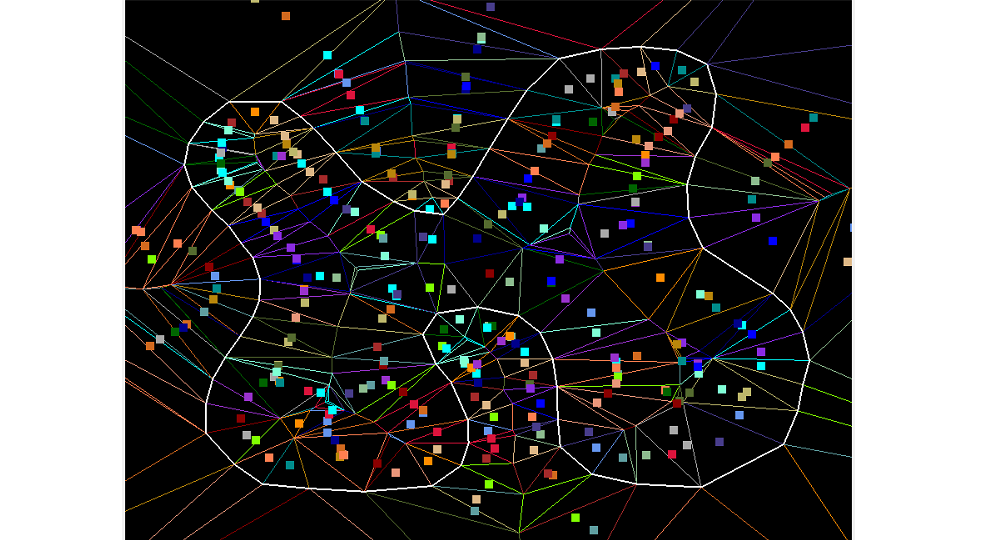
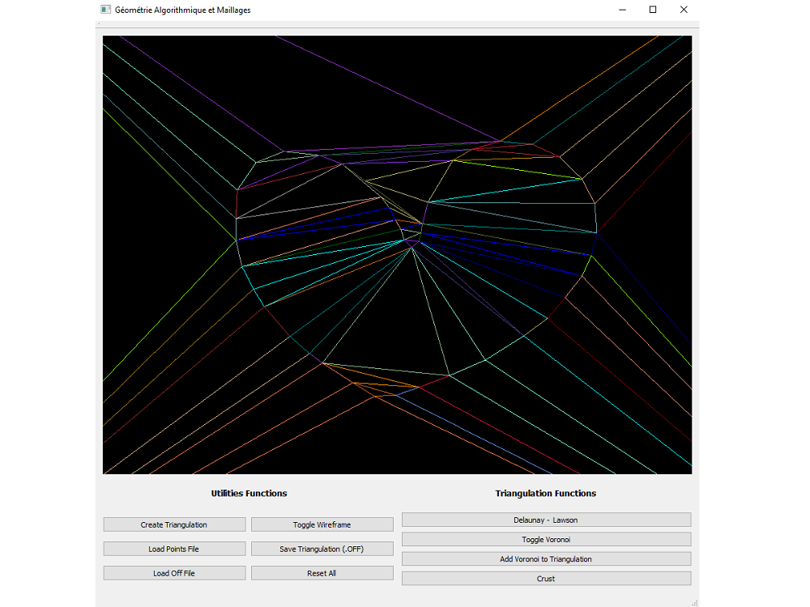

RAMILIJAONA Nathan  
RICHE Vincent 

<h2> <center> RAPPORT </center>  </h2>
<h2><center>Géométrie Algorithmique et Maillages</center></h2>

## Introduction
Le but de ce projet était de générer des maillages 2D. En partant d’un triangulation simple, il fallait pouvoir la rendre de Delaunay et pouvoir en reconstruire une approximation des contours 2D.
Le code a été réalisé en C++ à l’aide de la librairie Qt pour gérer les interfaces et OpenGL.

## Travail réalisé

Le programme permet de réaliser une *triangulation naive*, la rendre en *triangulation de Delaunay* (avec l’algorithme de *Lawson*), d’y ajouter des points (à l'aide de la souris) et repasser automatiquement en *triangulation de Delaunay* avec l’algorithme *de Delaunay incrémental*. Il est aussi possible de reconstruire les contours avec l'algorithme de *Crust* en calculant les centres de *Voronoi*. 

Cependant, l'algorithme pour mettre à jour l'enveloppe convexe quand on ajoute un point en dehors d'une face n'a pas été réalisé.  
Nous résolvons ce problème de la manière suivante : nous créons une boite englobante (autour des points pour la lecture de fichiers, ou placer arbitrairement en triangulation "custom"), et ajoutons deux triangles (auxquelles nous initialisons les voisins à la main) centré sur la boite englobante.

L’interface graphique a été grandement améliorée afin que l’utilisateur puisse complètement interagir avec le programme sans le relancer.

La figure 1 ci-contre montre le résultat que nous obtenons sur un fichier de points 2D.

*<center>Figure 1 : Affichage de la reconstruction par Crust en blanc, de la triangulation de Delaunay  et des centres de Voronoi pour chaque triangle.</center>*

+++

## Explication des principaux algorithmes
Nous allons expliquer ici les principaux algorithmes implémentés. 
Tout d’abord, il faut savoir que nous possédons globalement dans notre architecture une classe *Vertex* (correspondant un point dans la triangulation), une classe *Face* (correspondant à un triangle, contenant ses vertex incidents, et ses faces voisines), et une classe *Triangulation* (contenant des *QVector* de points et de faces).

### Ajout d’un point à la triangulation

Quand nous ajoutons un point à la triangulation, nous utilisons l'algorithme suivant :
```
On crée un booléen found initialisé à false
On ajoute le point p dans le Qvector de vertices
Pour chaque faces j
	Si le point appartient à j 
		On passe found à true
		On Split() la face j en trois nouvelles faces à partir du point p
		break
	Fin Si
Fin Pour

Si found est égale à false
	On ajoute le point à l’enveloppe convexe
Fin Si
```

Nous testons si le point appartient à une face avec le prédicat *IsInFace* qui calcule les aires signées pour chaque arête du triangle. Si les aires sont positives, le point est dans la face.  
L’algorithme de *Split* est celui vu en cours. Nous ajoutons des faces touchées par le *Split* dans le *QVector* de faces modifiés (*facesModified*).

+++

### Triangulation *de Delaunay* par l'algorithme de *Lawson*

Au début de cette fonction, nous ajoutons toutes les faces de la triangulation dans un *QVector* appelé *facesModified*.
Voici l’algorithme en pseudo code :

```
Tant qu’il reste des faces modifiées
	On récupère et enlève la première face fA du QVector
	Pour ses trois faces voisines
		On récupère la face voisine fB
		Si la fB n’existe pas ou si les fA et fB sont convexes
			On passe à l’itération suivante
		Fin Si
	Fin Pour
		
    On récupère le vertex v de fB n’appartenant pas à l’arrête
    Si v appartient au cercle circonscrit à fA
    	On Flip() pour renverser l’arrête entre fA et fB
    Fin Si
Fin Tant Que
```

L’algorithme de *Flip* est celui vu en cours. Nous ajoutons les faces touchées par le *Flip* dans le *QVector* de faces modifiées (*facesModified*).

### Algorithme de *Delaunay Incrémentale*
Cet algorithme fonctionne exactement comme celui de *Lawson*, c’est juste l’entrée qui est différente, à savoir le *QVector* de faces modifiées. En effet il ne contient pas cette fois toutes les faces, mais seulement celles qui ont été touchées par l’algorithme du *Split* ou du *Flip*.

### Calcul des centres de *Voronoi*

Dans cette fonction, nous calculons les centres de *Voronoi* comme centres des cercles circonscrits des faces de la triangulation.
Nous avons calculé les coordonnées cartésiennes des centres des cercles comme expliqué [ici](https://en.wikipedia.org/wiki/Circumscribed_circle#Cartesian_coordinates_2).

+++

Pour appliquer *Crust*, il faut que les centres de *Voronoi* fassent partis de la triangulation. Toutefois, les points « normaux » et les centres de *Voronoi* doivent être différencié, c’est pourquoi nous avons introduit un booléen qui permet de savoir de quel type est le vertice.  

###  *Crust*
*Crust* permet de reconstruire une approximation du contour d'un objet 2D à partir de points connus comme dit précédemment. Nous le faisons dans la fonction *draw* qui permet d’afficher les triangles, points de la triangulation en OpenGL.

Algorithme d'affichage pour *Crust* :
```
Pour toutes les faces
	On récupère ses trois vertices : p0, p1, et p2
	Si p0 et p1 ne sont pas des centres de Voronoi
		On dessine une ligne entre les points p0 et p1
	Fin Si

	Si p1 et p2 ne sont pas des centres de Voronoi
		On dessine une ligne entre les points p1 et p2
	Fin Si

	Si p2 et p0 ne sont pas des centres de Voronoi
		On dessine une ligne entre les points p2 et p0
	Fin Si
Fin Pour
```

## Interface Graphique
Nous avons réalisé l'interface graphique à l'aide de QT Creator. De base, la fenêtre contenait la vue OpenGL, nous y avons ajouté différents boutons pour interagir avec le programme. En effet, il y a un bouton pour chacune de ces actions :
 - Ouvrir un fichier de points 2D ou un maillage au format OFF.
 - Sauvegarder une triangulation au format OFF.
 - Changer le mode d'affichage de la triangulation : triangles ou lignes.
 - Interagir avec les étapes du pipeline de triangulation (algorithme de *Delaunay*, calcul des centres de *Voronoi* ou algorithme de *Crust*).  

Il est aussi possible d’ajouter des points en récupérant la position d’un clic souris dans la fenêtre de rendu. Le clic gauche permet d’ajouter un point, le clic droit permet de faire pivoter la triangulation.


*<center>Figure 2 : Interface de l'application</center>*

## Conclusion
Nous sommes plutôt contents des résultats obtenus. Par ailleurs, le fait d’avoir une interface aboutie permet de se rapprocher un peu plus « d’un produit fini » et apporte un certain attrait au projet.  
Pour ce qui est des améliorations, le fait de pouvoir avoir une enveloppe convexe fonctionnelle serait d'un point point. Ensuite, nous gérons ici que des triangulations 2D, une autre piste d’amélioration serait de pouvoir faire des triangulations 3D.